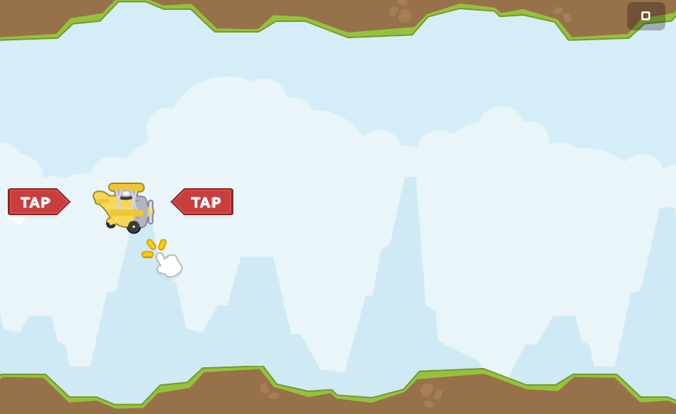
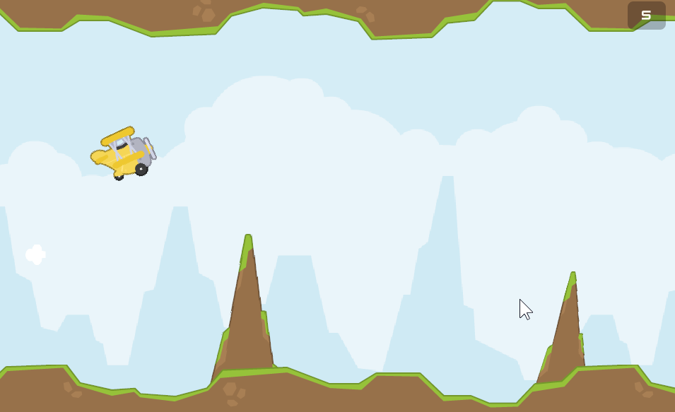
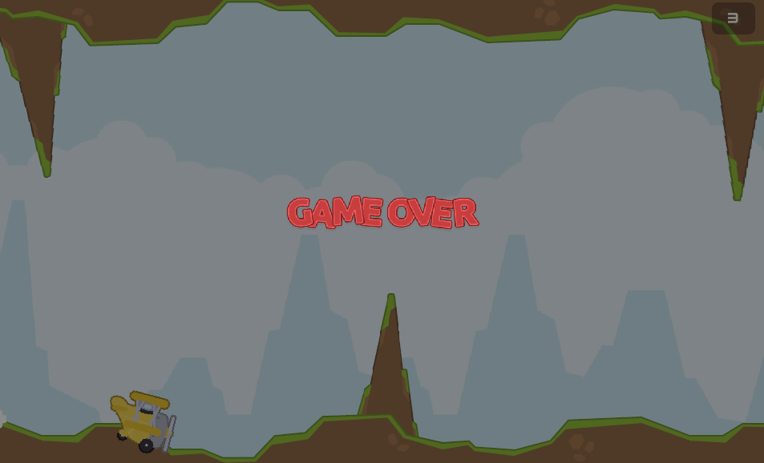

# U.Learn.Flappy_Bird

## Галерея

<table>
  <tr>
    <td></td>
    <td></td>
  </tr>
  <tr>
    <td></td>
    <td></td>
  </tr>
</table>

**[Играть на itch.io](https://mitfart.itch.io/learn-flappy-bird)**

## Управление

Для прыжка нажмите **Space**, **Z**, **Numpad Enter** или **левую кнопку мыши**.

## Открытие проекта

Откройте репозиторий в **Unity 6000.0.42f1** и загрузите сцену `Boot`.
